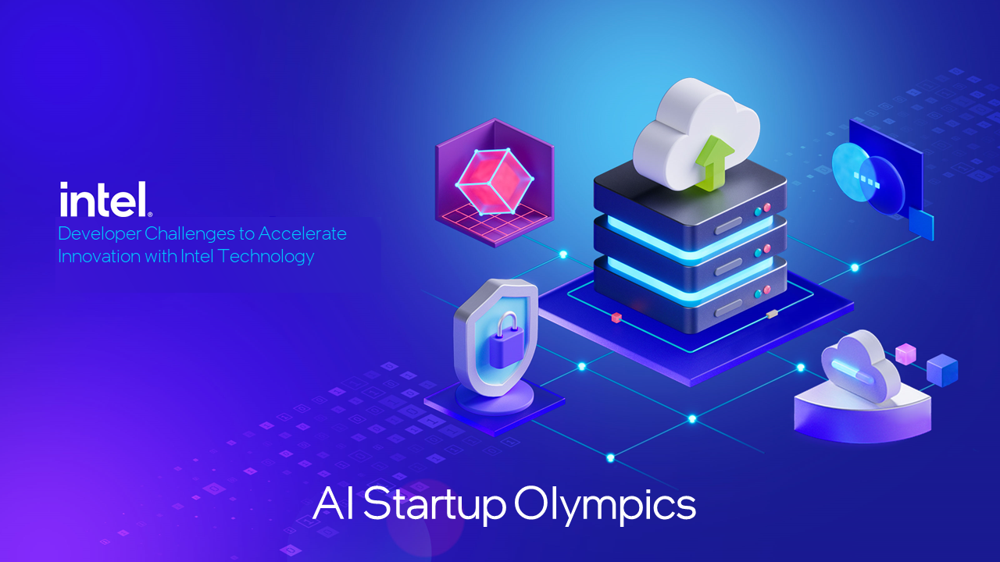

<h1>AI Startup Olympics Hackathon</h1>

# What's this Hackathon About?
The AI Startup Olympics is a 3-day event dedicated to accelerating the implementation of Intel’s accelerated software and hardware in industry-leading solution architectures. The Hackathon challenge consists of building an ML application according to specifications defined in the “Solution Blueprint.” This blueprint outlines the architectural components that your team must build to support your solution. The blueprint provides enough flexibility for teams to build to choose the data and AI problem they want to solve – which means you can bring your data and code to the hackathon. Teams will be judged on their ability to build according to these specs, solution innovation, and workload optimization. 



# What if you don’t have code or data to bring? 
For teams that don’t have their own code and data to bring to the event, Intel will provide a set of alternative sample solutions with data and code that participants can use as an alternative starting point.  

# Alternative Sample Solutions and Datasets
- [Drone Landing Areas (Computer Vision)](https://github.com/oneapi-src/drone-navigation-inspection)
- [Medical Imaging Diagnostics (Computer Vision)](https://github.com/oneapi-src/medical-imaging-diagnostics)
- [Customer Chatbot (Natural Language Processing)](https://github.com/oneapi-src/customer-chatbot)
- [Disease Prediction (Natural Language Processing)](https://github.com/oneapi-src/disease-prediction)

# Blueprint Description
Build an ML application based on the provided microservice architecture pattern. The design pattern splits data, training, and inference components into individual microservices. 


## Blueprint Requirements:
- Application must be split into separate processes containing one or more modules. You must have at least two of the following microservices: data wrangling/processing, training and validation, and inference. 
- Each microservice must be deployed as a containerized application using docker or other popular container management tools. 
- At least one of your two microservices must leverage an intel deep learning accelerated extension. 
- Each microservice must contain an API end-point that can receive HTTP requests in JSON format. 
- The only compute resources and storage for your solution are the 4th Generation Intel Xeon Bare Metal IDC Instance.

## Optional Side Quests: Optional side quests can be awarded additional points. Awarding these points will be at the discretion of judges/mentors.
- Incorporate a working database layer (10pts)
- Add Synchronous or Async. event messaging (10pts)
- Demonstrate the use of OpenMP Topology Optimizations (5pts)
- Leverage an Intel Accelerated Extension in both of your main microservices (7pts)
- Build a model observability or performance tracking microservice. (10pts)
- Include a performance benchmark report in your final presentation (5pts)

*Keep in mind that All components of blueprint specs and side quests are open to interpretation by intel staff supporting the judging process.*

# Getting Access to Intel Developer Cloud
At the time of writing these instructions, the Intel Developer Cloud is in Beta. To receive access to this resource you can visit https://cloud.intel.com 

Once you have your account you'll be able to access various types of compute instances including: 
- 4th Gen Xeon VMs
- 4th Gen Xeon Bare Metal 
- Flex Series ATSM GPUs 
- Ponte Vecchio Data Center GPUs 

# Running Blueprint Sample Solution

## Reference Solution
We use a computer vision based model building for quality visual inspection based on a dataset for pharma industry. It includes different data augmentations and train the VGG model using this dataset.

## Key Implementation Details
- Seperate Packages for Training and Inference
- Containerized Microservices
- Fastapi API endpoints


#### 1. Clone AI-Hackathon repository

```
git clone https://github.com/intel/AI-Hackathon.git
```

#### 2. Check if docker is installed 

```
docker --version
```

If you get an error, then follow the instructions below to install docker. Otherwise, move on to step 3.

```
# installing docker 
sudo apt-get update
sudo apt install docker.io

# add docker user to sudo group
sudo groupadd docker
sudo gpasswd -a $USER docker
newgrp docker
```

#### 3. Access the ai-startup-olympics folder

```
cd AI-Hackathon/ai-startup-olympics
```

#### 4. The prep.sh script, downloads the MvTec pills dataset, builds train, test, and blind datasets. It also creates a /models directory for storing training outputs. Run this script before launching your containers. 

```
bash prep.sh
```

#### 5. The following commands will allow you to launch the docker containers. In an ideal scenario, we would use a combination of databases and object stores to move data and information between microservices. In this implemenation, this functionality will be entirely managed using our local disk storage. Since containers have limited access to local disk, we will have to bind use "mind mounts" to give containers access to our local file system with the "-v" command. 

```
# launch training container and start /train endpoint server
docker build -t train -f Dockerfile.Training .
docker run -d -p 5000:5000 -v "$(pwd)":/training/mount train

# launch inference container and start /predict endpoint server
docker build -t predict -f Dockerfile.Inference .
docker run -d -p 5001:5001 -v "$(pwd)":/inference/mount predict
```

#### 6. Check active images and running docker containers 

```
# check images 
docker images 

# check active containers 
docker ps
```

#### 7. Testing the health of your servers with a ping

```
# check health of training server
curl -X GET http://localhost:5000/ping

# check health of inference server
curl -X GET http://localhost:5001/ping

# you should get the following response if servers are running 
{"message":"Server is Running"}
```

#### 8. Make HTTP POST Requests to Training and Inference servers. If you need help verifying your json body of your payload, we recommend using https://jsonformatter.curiousconcept.com/

Making a POST request to the training server
```
curl -X POST http://localhost:5000/train -H 'Content-Type: application/json' -d '{"data_folder":"/training/mount/data","neg_class":1,"model_path":"/training/mount/models/pills_vgg.h5"}'
```

Making a POST request to the inference server
```
curl -X POST http://localhost:5001/predict -H 'Content-Type: application/json' -d '{"trained_model_path":"/inference/mount/models/pills_vgg.h5","data_folder":"/inference/mount/data/","batch_size":5}'
```

## Troubleshooting Suggestions 
- If you get an Error indicating that a port is already in use you can kill the job running on said port. 

```
ps aux | grep python
sudo kill -9 <job id>
```

- If you are getting "Internal Server Error" - try checking the docker logs

```
docker logs <container ID>

#find the container ID using `docker ps`

# to track live logs
docker logs <container ID> --follow
```

- If you are uncertain about your docker container environment, access a container shell environment using the following commands

```
# start bash shell
docker exec -u 0 -it <container ID> bash

# exit shell 
exit
```


