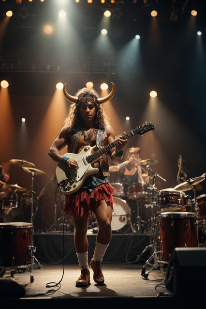

# Intel Generative AI Rockstar Challenge

## Agenda

- Introduction to the Intel Generative AI Rockstar Challenge
- Quick review of the [Guidelines](guidelines.md)
- Quick review of what we are providing and the flow

## Judging Criteria

- 20 points for style
- 20 points for humor
- 40 points for use of technology (AMX, advanced models, etc)
- 20 points for the use of technology in an unexpected way

**Send your submissions via email to the address provided by on site staff.**

## Environment

We will provide each team one M7i.4xlarge instance on AWS. These instances use the latest [Intel 4th Generation Xeon CPUs](https://www.intel.com/content/www/us/en/products/docs/processors/xeon-accelerated/4th-gen-xeon-scalable-processors.html), which include new accelerators that help speed up AI and other workloads. This event will focus on taking advantage of the [Intel AMX](https://www.intel.com/content/www/us/en/products/docs/accelerator-engines/advanced-matrix-extensions/overview.html) accelerator to do AI inferencing on CPUs.

These VMs will already be provisioned for you and will include a few components already installed and configured. You will have the opportunity to experiment with additional models or other settings as part of the workshop.

### Pre-Installed Components

- [Intel Optimized Cloud Recipes](https://github.com/intel/optimized-cloud-recipes)
- [Intel Extension for PyTorch](https://github.com/intel/intel-extension-for-pytorch)
- [FastChat](https://github.com/lm-sys/FastChat)

We have used one of the new [Intel Cloud Optimization Modules](https://www.intel.com/content/www/us/en/developer/topic-technology/cloud-optimization.html) to provision the VMs for this exercise. For this event, we are using the [AWS VM Module](https://github.com/intel/terraform-intel-aws-vm).

---

## Competition Flow

### Create Song Lyrics

The first part of the competition will have you generate song lyrics for your album. The lyrics shouldn't be overly long but should match the theme you want for your album.

**[Song Lyric Instructions](fastchat/README.md)**

### Create Album Cover

The second part of the competition will have a generate an album cover that goes along with your song lyrics. Refer to the [Official Rules](terms.md) to make sure your image follows those guidelines.

**[Album Cover Instructions](stable-diffusion/README.md)**

## Submission for Competition

Refer to each of the guides for what you will need to collect and submit to be entered in the competition. So make your submission, you need to go to this site:

**[Contest Submission](https://intelrockstar2023.s3.us-west-1.amazonaws.com/rockstars.html)**
