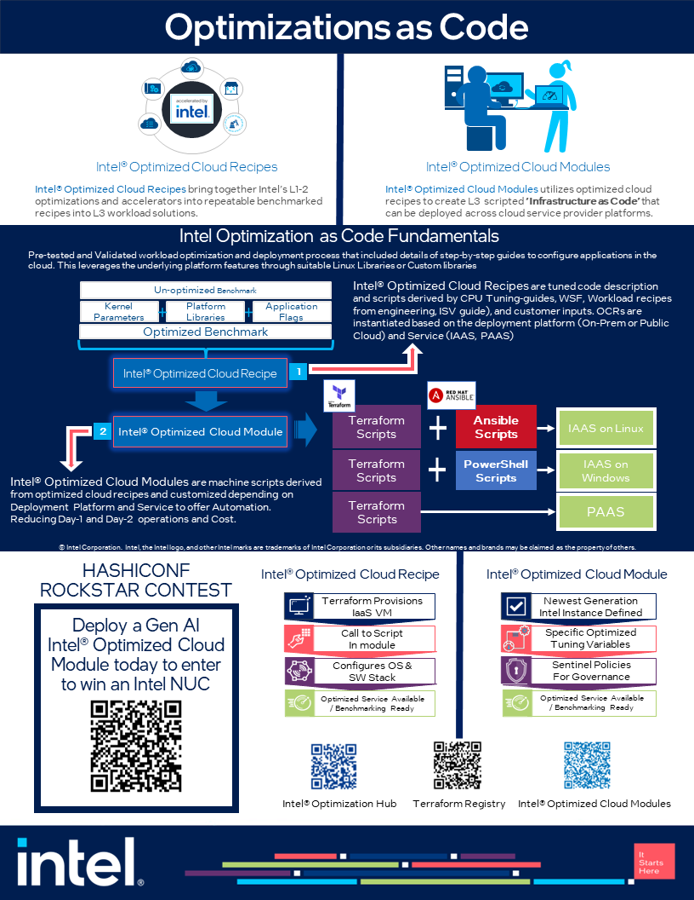

# Intel Generative AI Rockstar Contest

## Agenda

- Introduction to the Intel Generative AI Rockstar Challenge
- Quick review of the [Guidelines](guidelines.md)
- Quick review of what we are providing and the flow

## Environment

You will need an AWS account as this terraform module will launch a M7i.4xlarge instance on AWS. These instances use the latest [Intel 4th Generation Xeon CPUs](https://www.intel.com/content/www/us/en/products/docs/processors/xeon-accelerated/4th-gen-xeon-scalable-processors.html), which include new accelerators that help speed up AI and other workloads. This event will focus on taking advantage of the [Intel AMX](https://www.intel.com/content/www/us/en/products/docs/accelerator-engines/advanced-matrix-extensions/overview.html) accelerator to do AI inferencing on CPUs.

### Components that will be installed

- [Intel Optimized Cloud Recipes](https://github.com/intel/optimized-cloud-recipes)
- [Intel Extension for PyTorch](https://github.com/intel/intel-extension-for-pytorch)
- [FastChat](https://github.com/lm-sys/FastChat)

This contest leverages the [Intel Cloud Optimization Modules](https://www.intel.com/content/www/us/en/developer/topic-technology/cloud-optimization.html) to provision the VM. For this event, we are using the [AWS VM Module](https://github.com/intel/terraform-intel-aws-vm).

---

## Competition Flow

### Create Song Lyrics

This contest is goint to be leveraging "fast chat" where we will have you generate song lyrics for your album. The lyrics shouldn't be overly long.

**[Song Lyric Instructions](fastchat/README.md)**

Refer to the [Official Rules](terms.md)

## Submission for Competition

Submissions for this contest will be done via X.com (aka Twitter)
1. You must have an X.com account
2. Submit a post on X.com
    Included in the post must be:
        1) A screenshot of your Terraform code output successfully deployment
        2) A screenshot of your song lyrics that were generated 
3. Use the #IntelGenAI as the hashtag in your x.com post

