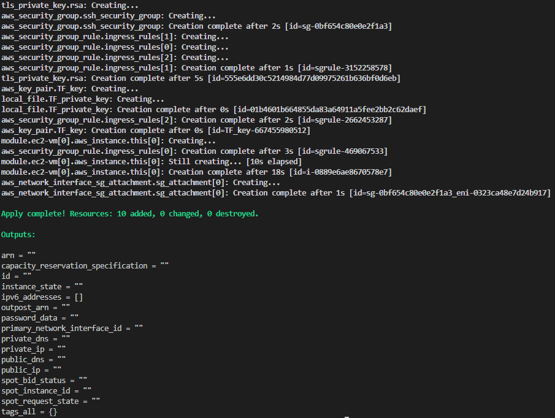
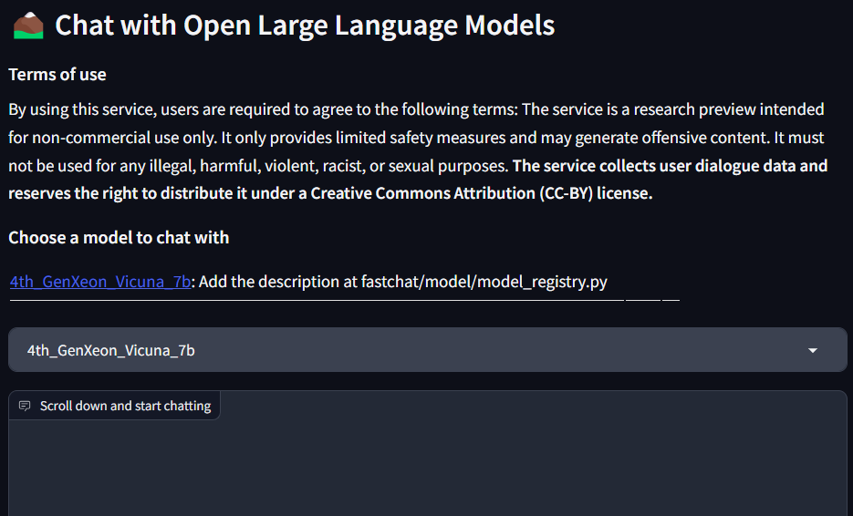

# Generate Song Lyrics

We will be using one of Intel's Optimized Cloud Recipes. If you want to experiment with this on your own, you can find the recipe [here](https://github.com/intel/optimized-cloud-recipes/tree/main/recipes/ai-fastchat-amx-ubuntu).

This recipe is included in the Terraform module.  This installs and configures [Fastchat](https://github.com/lm-sys/FastChat) on the VM created in your AWS account. The [Intel Extension for Pytorch](https://github.com/intel/intel-extension-for-pytorch) also deploys onto the VM, along with a few other components, for full details, refer to the recipe.

Intel AMX has been enabled by default.

## Instructions

Download and run the [gen-ai-fastchat](https://github.com/intel/terraform-intel-aws-vm/tree/main/examples/gen-ai-fastchat) Terraform Module 

```Shell
terraform init
terraform plan
terraform apply
```

- The output of completed terraform module should look similar to this



- After the module completes you will need to SSH to the public IP of the instance to access the console.  The public IP is generated as part of the instance creation so access your aws console to find the public ip in the details tab of the instance.  The module will generate a private key in the folder where you ran the "terraform apply" command.

Run the ssh command as below:
```hcl
ssh ubuntu@<Public_IP_Address_EC2_Instance> -i tfkey.private
```
* Note: If you get a permission denied message you may have to change the permissions of the tf.private file by using the command "CHMOD 400 tf.private" Then run step 5 again to connect.

- Once you are logged into the EC2 instance, run the command
```Shell
source /usr/local/bin/run_demo.sh
```
If this is successful you will see the following output:

```shell
ubuntu@ip-172-31-33-45:~$ source /usr/local/bin/run_demo.sh
2023-09-06 14:10:00 | INFO | gradio_web_server_multi | args: Namespace(host='0.0.0.0', port=None, share=True, controller_url='http://localhost:21001', concurrency_count=10, model_list_mode='once', moderate=False, add_chatgpt=False, add_claude=False, add_palm=False, anony_only_for_proprietary_model=False, register_openai_compatible_models=None, gradio_auth_path=None, elo_results_file=None, leaderboard_table_file=None)
2023-09-06 14:10:00 | INFO | gradio_web_server | Models: ['4th_GenXeon_Vicuna_7b']
2023-09-06 14:10:00 | INFO | stdout | Running on local URL:  http://0.0.0.0:7860
2023-09-06 14:10:02 | INFO | stdout | Running on public URL: https://64163ad5b65c927ff1.gradio.live
2023-09-06 14:10:02 | INFO | stdout |
2023-09-06 14:10:02 | INFO | stdout | This share link expires in 72 hours. For free permanent hosting and GPU upgrades, run `gradio deploy` from Terminal to deploy to Spaces (https://huggingface.co/spaces)
```

Open a browser and go to the public ip of your instance a browser.  
http://public_ip:7860

Once you get to the application, you will see a screen like this:



You can now generate the lyrics for your song.

## Submitting Results

For this portion of the contest, you will need to submit 2 screenshots:
1) A screenshot of the successful Terraform Run.
Here is an example


2) A screenshot the prompt you used and take a screenshot of the prompt and lyrics. 

**For the prompt and lyrics:**

```text
Prompt: Write a song about Star Wars in the style of Frank Sinatra
Lyrics: 

Verse 1:
A long time ago, in a galaxy far, far away
A hero emerged, to save us all from the dark side
He fought against the evil Empire, with a lightsaber in hand
And brought hope to the galaxy, with a wave of his wand

Chorus:
Star Wars, Star Wars, the epic space saga
With heroes and villains, it's a story we all know
From a tiny planet, to the Death Star
The Force is strong, with our Jedi warriors
```

**Pick one of these two types of screenshots to provide with your results.**


