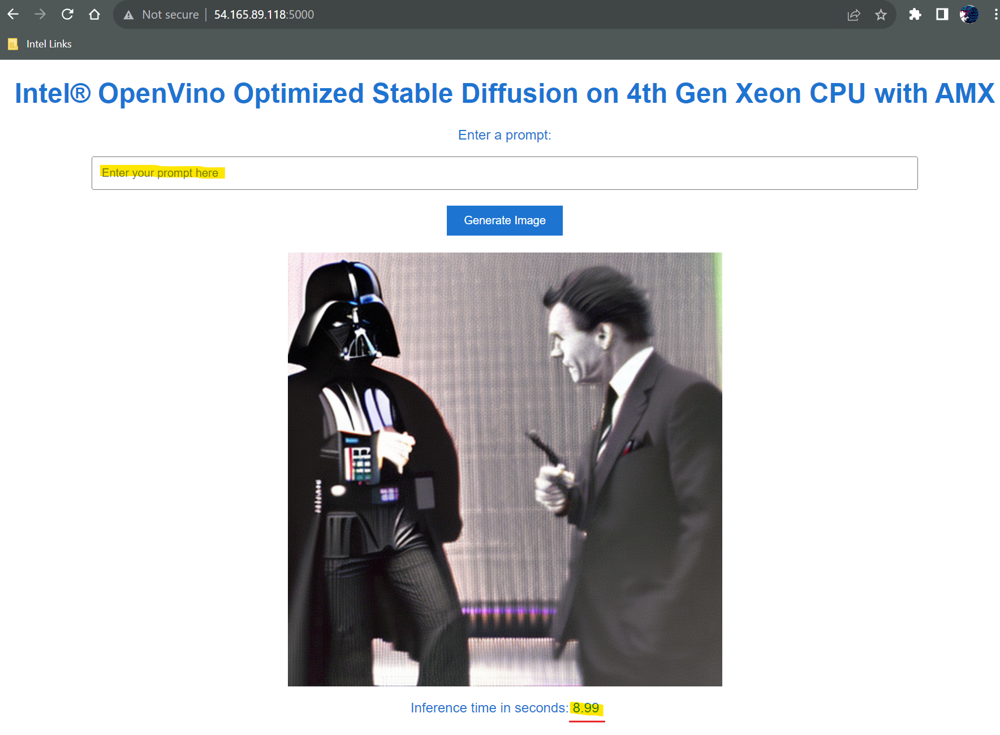

# Intel Generative AI Rockstar AWS re:Invent Drawing


## Details

- Complete this module to get 5 extra ticket entries to the drawing at AWS re:Invent 2023
- Deploy the [gen-ai-demo](https://github.com/intel/terraform-intel-aws-vm/tree/main/examples/gen-ai-demo) Terraform module using an AWS Cloud account
- The module will create an m7.4xlarge EC2 Instance with an Intel 4th Generation Xeon CPU in your AWS Account
- Access your EC2 instance via a web URL to create AI generated lyrics and Album cover
- Screen shot or take a picture of your successful "terraform apply" results plus fastchat generated lyrics and album cover, and bring that to the Intel  Booth at AWS re:Invent 2023, to pick up your 5 additional entries to win a Beelink Mini S12 Pro Mini PC
- See Contest [Guidelines](guidelines.md) for complete details

## Requirements
- AWS Cloud Account
- 30 minutes of your time

## Participation Overview

* Deploy the Terraform Module in your AWS account
  * Take a screenshot of the successful deployment

* Connect to the public ip of your EC2 instance to access the Fast Chat UI and the Stable Diffusion module  `http://yourpublicip:7860`
  * Enter in a prompt to generate song lyrics
  * Take a screenshot of the song lyrics generated

* Connect to the public ip of your EC2 instance to access the Stable Diffusion `http://yourpublicip:5000`
  * Use the prompt to generate a picture to use for your album cover. (Note the time it takes to generate using Intel AMX)
  * Open `http://yourpublicip:5001` and use the same prompt as above to generate your image.  (Note the time it takes to generate without Intel AMX)

* Bring a screenshot or picture of the following to the Intel Booth
    1) Terraform output of the successful deployment he Module
    2) The song lyrics you generated using FastChat
    3) Screen shot of your album cover


Refer to the [Official Rules](terms.md)


## Instructions on how to deploy the GenAI FastChat and Stable Diffusion module.

NOTE: This module will spin up an m7i.4xlarge in the us-east1 region by default. Make sure to use the terraform destroy command to ensure the instance is deleted when you are finished.

<b><font color=red> This module takes approximately 20 minutes to download the LLM and then configure the EC2 instance via the ansible recipe.</b></font>

To start, open your AWS account and click the Cloudshell
At the command prompt enter
```Shell
terraform
```
If you get an error then you will need to install Terraform. Use these commands below to install Terraform into the AWS Cloudshell
```Shell
git clone https://github.com/tfutils/tfenv.git ~/.tfenv
mkdir ~/bin
ln -s ~/.tfenv/bin/* ~/bin/
tfenv install 1.3.0
tfenv use 1.3.0
```
Download and run the [Gen-AI-Demo](https://github.com/intel/terraform-intel-aws-vm/tree/main/examples/gen-ai-demo) Terraform Module by typing this command

```Shell
git clone https://github.com/intel/terraform-intel-aws-vm.git
```

Change into the `examples/gen-ai-demo` example folder

```Shell
cd terraform-intel-aws-vm/examples/gen-ai-demo
```

Run the Terraform Commands below to deploy the demos.

```Shell
terraform init
terraform plan
terraform apply
```

After the Terraform module successfully creates the EC2 instance, **wait ~20 minutes** for the recipe to download/install FastChat, Stable Diffusion and the LLM model before continuing.

Screen Capture the results of the Terraform Apply Command so you can bring that to us at the Intel Booth <br>
Example :


<br>

```Shell
WAIT 20 MINUTES
```
After the Terraform module successfully creates the EC2 instance, **wait ~20 minutes** for the recipe to download/install FastChat and the LLM model before continuing.

## Accessing the Demo

You can access the demos using the following:

- FastChat: `http://yourpublicip:7860`

1. Type in the prompt to interact with fastchat. Enter your message or question in the chat prompt to see the Fastchat in action?  Example:

    ```text
    Prompt: Write a song about Star Wars in the style of Frank Sinatra
    ```

    The output from FastChat:
    ```text
    Lyrics: 

    Verse 1:
    A long time ago, in a galaxy far, far away
    A hero emerged, to save us all from the dark side
    He fought against the evil Empire, with a lightsaber in hand
    And brought hope to the galaxy, with a wave of his wand

    Chorus:
    Star Wars, Star Wars, the epic space saga
    With heroes and villains, it's a story we all know
    From a tiny planet, to the Death Star
    The Force is strong, with our Jedi warriors
    ```

    ***Screenshot your lyrics***
2. Create your Album Cover using Intel Optimized Stable Diffusion: `http://yourpublicip:5000`
Enter a prompt to generate a picture

Notice the time to complete at the bottom using Intel AMX

***Screenshot your Album Cover***

3. Out of the box Stable Diffusion: `http://yourpublicip:5001`
Enter the same prompt as above prompt to generate a picture

Notice the time to complete at the bottom 

4. Bring your screenshots to us at the Intel booth between 4:00pm PST November 27th and 2:00pm PST November 30th 

5. To delete the demo:<br>
  From the AWS Cloud Shell, run the command:
  ```text
    terraform destroy
```


## Module Overview
You will need an AWS account as this terraform module will launch a M7i.4xlarge instance on AWS. These instances use the latest [Intel 4th Generation Xeon CPUs](https://www.intel.com/content/www/us/en/products/docs/processors/xeon-accelerated/4th-gen-xeon-scalable-processors.html), which include new accelerators that help speed up AI and other workloads. This event will focus on taking advantage of the [Intel AMX](https://www.intel.com/content/www/us/en/products/docs/accelerator-engines/advanced-matrix-extensions/overview.html) accelerator to do AI inferencing on CPUs.

### Components of the Module
- [Intel Optimized Cloud Recipes](https://github.com/intel/optimized-cloud-recipes)
- [Intel Extension for PyTorch](https://github.com/intel/intel-extension-for-pytorch)
- [FastChat](https://github.com/lm-sys/FastChat)

For this you will be using one of the [Intel Cloud Optimization Modules](https://www.intel.com/content/www/us/en/developer/topic-technology/cloud-optimization.html) to provision the VM. <br>
You will be using the [AWS VM Module](https://github.com/intel/terraform-intel-aws-vm) and the gen-ai-demo example in that module.

The gen-ai-fastchat example leverages one of Intel's Optimized Cloud Recipes. If you want to experiment with this on your own, you can find the recipe [here](https://github.com/intel/optimized-cloud-recipes/tree/main/recipes/ai-fastchat-amx-ubuntu).

This recipe is included in the Terraform module you are deploying.  This installs and configures [Fastchat](https://github.com/lm-sys/FastChat) on the VM created in your AWS account. The [Intel Extension for Pytorch](https://github.com/intel/intel-extension-for-pytorch) also deploys onto the VM, along with a few other components, for full details, refer to the recipe.

Intel AMX has been enabled by default.

## Considerations
- The AWS region where this example is run should have a default VPC


