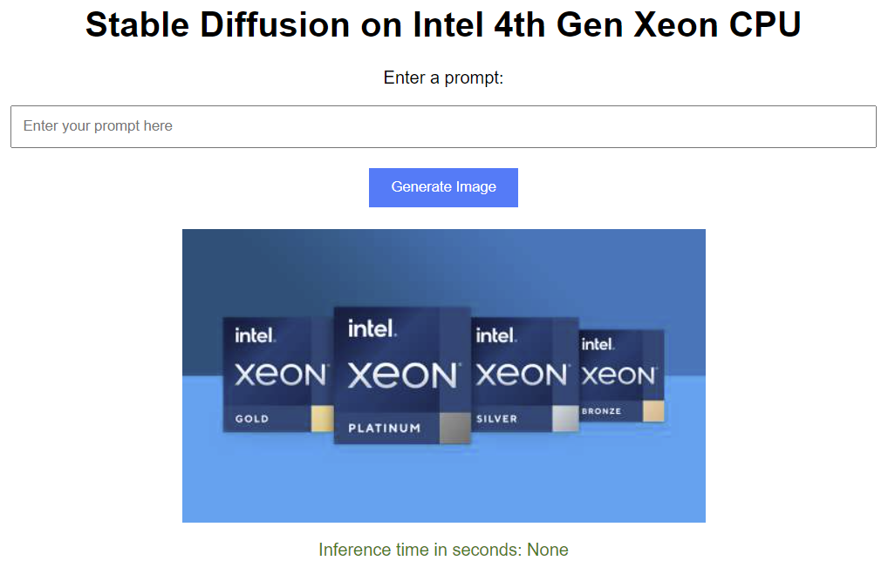

# Generate Album Cover

## Instructions

You should recieve information about how to login to your assigned VM via the email address that you used to register. If not, please check with the on-site staff.

- Login to the VM using the provided credentials
- Run the following commands

### Pre-requisites

```shell
git clone https://github.com/intel/AI-Hackathon.git
cd AI-Hackathon/genai-rockstar-challenge-2023/stable-diffusion
pip install -r requirements.txt
```

### Using the app

To start the app you run the following command:

```shell
python app.py
```

If it is successful you will see the following on the console:

```shell
2023-09-13 21:53:34,161 - torch.distributed.nn.jit.instantiator - INFO - Created a temporary directory at /tmp/tmpz93u03rv
2023-09-13 21:53:34,161 - torch.distributed.nn.jit.instantiator - INFO - Writing /tmp/tmpz93u03rv/_remote_module_non_scriptable.py
 * Serving Flask app 'app'
 * Debug mode: on
2023-09-13 21:53:34,636 - werkzeug - INFO - WARNING: This is a development server. Do not use it in a production deployment. Use a production WSGI server instead.
 * Running on all addresses (0.0.0.0)
 * Running on http://127.0.0.1:5000
 * Running on http://172.31.87.3:5000
2023-09-13 21:53:34,637 - werkzeug - INFO - Press CTRL+C to quit
2023-09-13 21:53:34,637 - werkzeug - INFO -  * Restarting with stat
2023-09-13 21:53:35,835 - torch.distributed.nn.jit.instantiator - INFO - Created a temporary directory at /tmp/tmpdo86ic3w
2023-09-13 21:53:35,835 - torch.distributed.nn.jit.instantiator - INFO - Writing /tmp/tmpdo86ic3w/_remote_module_non_scriptable.py
2023-09-13 21:53:36,293 - werkzeug - WARNING -  * Debugger is active!
2023-09-13 21:53:36,294 - werkzeug - INFO -  * Debugger PIN: 833-138-988
```

You can then access the UI for the application at `http://vmpublicip:5000`

You should see a screen like this, which means you can now generate images.



Notice that you can see how long the image takes to generate.

## Adjusting Parameters

If the application is running, then you can press `ctrl-c` to get it to stop. You can then adjust the settings for the application. To modify the settings, you'll need to edit the file `sd_amx.py` and look for this block of code.

```python
def run_stable_diffusion(
    prompt: str,
    model_id: str = "runwayml/stable-diffusion-v1-5",
    device: str = 'cpu',
    torch_dtype: torch.dtype = torch.bfloat16,
    num_inference_steps: int = 10,
    num_images: int = 1,
    output_folder: str = 'output_images'
    ):
```

If you want to change the model, modify the `model_id` setting. If you want to increase the number of inference steps used to generate your image, modify the `num_inference_steps` settings. Increasing the number of inferencing steps will increase quality but also increase the time it takes to generate the image.

### Turning Intel AMX On and Off

By default this application is configured to use Intel AMX to accelerate image generation. To see the difference that Intel AMX has on how quickly images are generated, modify the variable `torch_dtype` from `torch.bfloat16` to `torch.float32` and restart the application `python app.py`. You will see a noticable increase in the time each image takes to generate.

## Submitting Results

For this portion of the challenge, you will need to copy the prompt you used, the image that was generated, the settings you used, and the image generated. Include these in your submission. Examples are below. Don't finalize your submission until you've completed both parts of the challenge. The image you submit should've been generated using Intel AMX.

***For the prompt and settings***

For the prompt and settings you can copy the section from the `sd_amx.py` script that you used to create the album cover image. An example is below:

```python
def run_stable_diffusion(
    prompt: str,
    model_id: str = "runwayml/stable-diffusion-v1-5",
    device: str = 'cpu',
    torch_dtype: torch.dtype = torch.bfloat16,
    num_inference_steps: int = 10,
    num_images: int = 1,
    output_folder: str = 'output_images'
    ):
```

For the image, attach the image that was generated.
